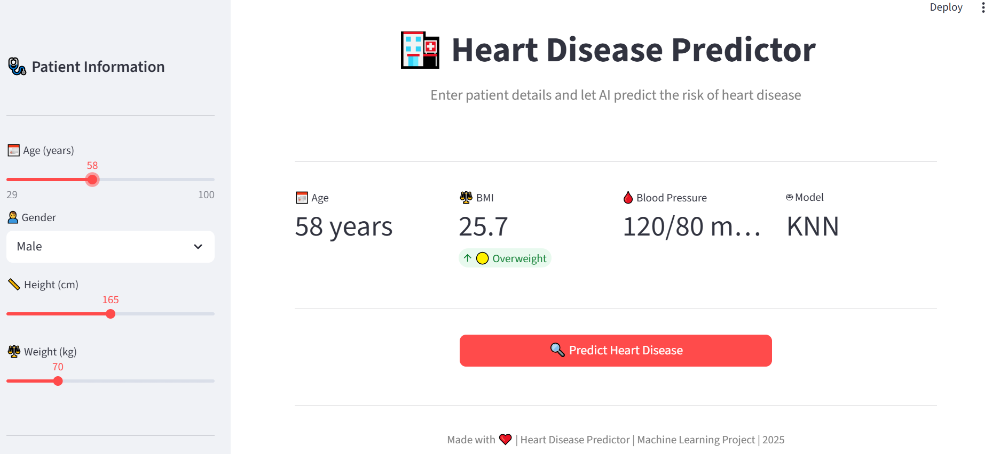
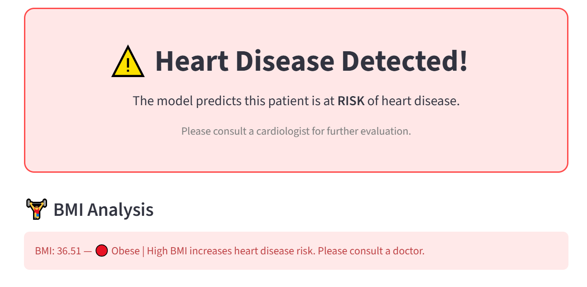
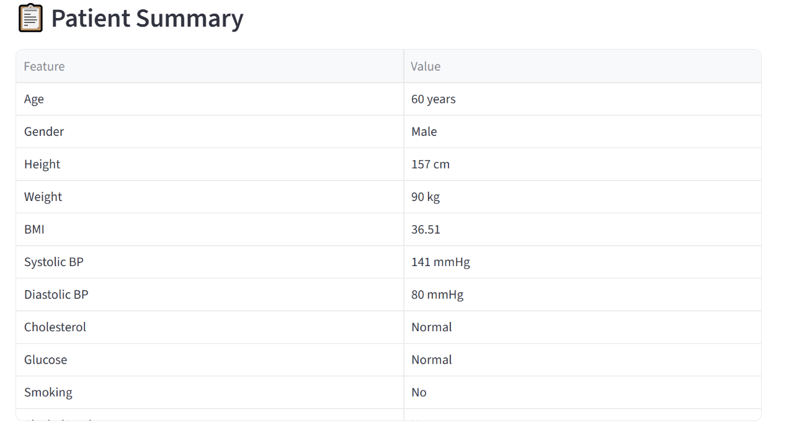
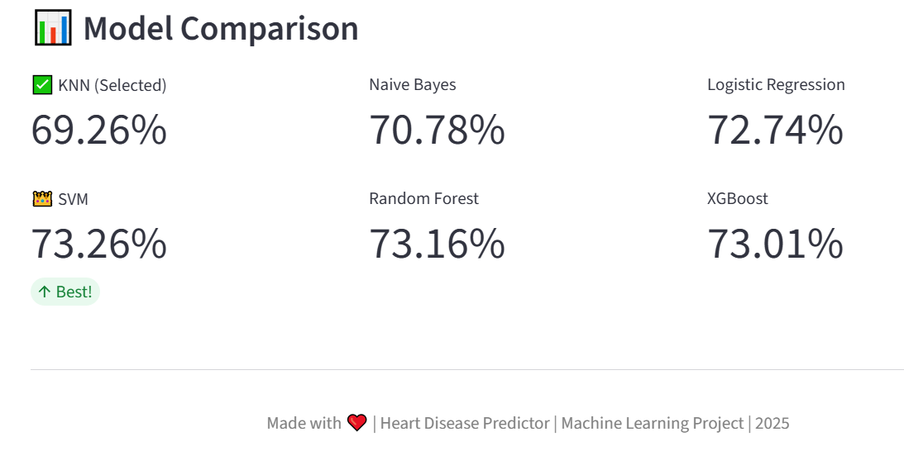
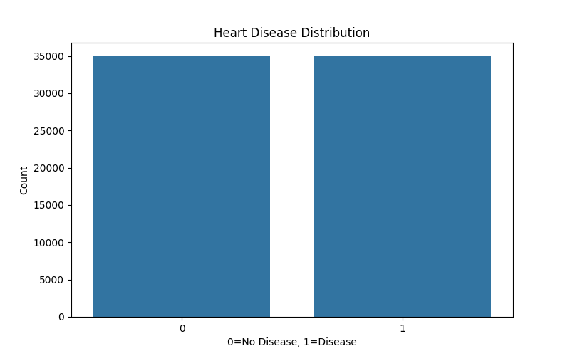
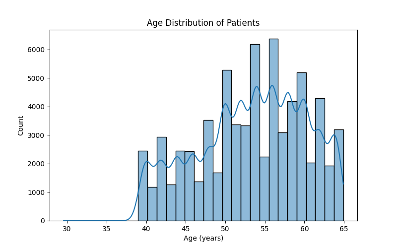
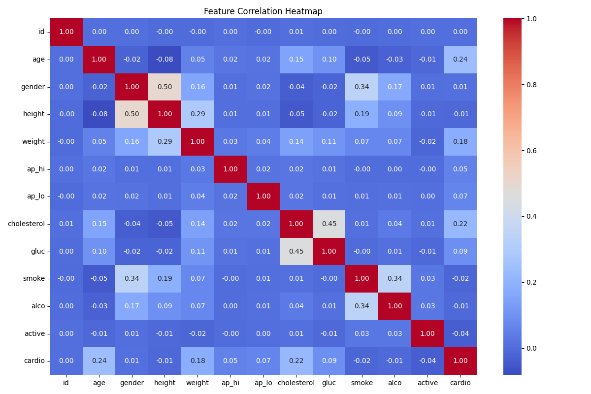

# 🏥 Heart Disease Predictor

A Machine Learning web application that predicts the risk of heart disease based on patient health data.


---

## 📋 About

This project uses **6 different ML models** to predict whether a patient is at risk of heart disease based on features like age, blood pressure, cholesterol, BMI, and lifestyle habits.

---

## 🖥️ App Screenshots

### 🏠 Main Interface


### 🔍 Prediction Result


### 📊 Patient Summary & Model Comparison



---

## 📈 Data Visualizations

### 🎯 Target Distribution


### 📅 Age Distribution


### 🔥 Correlation Heatmap


---

## 🤖 Models Used

| Model | Accuracy |
|-------|----------|
| SVM | 73.26% 👑 |
| XGBoost | 73.01% |
| Logistic Regression | 72.74% |
| Naive Bayes | 70.78% |
| Random Forest | 70.78% |
| KNN | 69.32% |

---

## 🛠️ Tech Stack

- **Python** — Core programming language
- **Scikit-Learn** — ML model training
- **XGBoost** — Gradient boosting model
- **Streamlit** — Web app framework
- **Pandas & NumPy** — Data processing
- **Matplotlib & Seaborn** — Data visualization

---

## 📊 Dataset

- **Source:** Kaggle - Cardiovascular Disease Dataset
- **Samples:** 70,000 patient records
- **Features:** 12 (age, gender, height, weight, blood pressure, cholesterol, glucose, smoking, alcohol, physical activity, BMI)

---

## 🚀 How to Run

1. Clone the repository
```bash
git clone https://github.com/YOUR_USERNAME/heart-disease-predictor.git
cd heart-disease-predictor
```

2. Create virtual environment
```bash
python -m venv venv
source venv/bin/activate  # On Windows: venv\Scripts\activate
```

3. Install dependencies
```bash
pip install -r requirements.txt
```

4. Run the app
```bash
streamlit run app.py
```

---

## 📂 Project Structure

```
heart-disease-predictor/
├── data/
│   ├── cardio_train.csv
│   ├── cardio_cleaned.csv
│   └── preprocessed_data.pkl
├── models/
│   ├── knn_model.pkl
│   ├── naive_bayes_model.pkl
│   ├── logistic_regression_model.pkl
│   ├── svm_model.pkl
│   ├── random_forest_model.pkl
│   └── xgboost_model.pkl
├── images/
│   ├── app_screenshot.png
│   ├── prediction_result.png
│   ├── model_comparison.png
│   ├── target_distribution.png
│   ├── age_distribution.png
│   └── correlation_heatmap.png
├── explore_data.py
├── clean_data.py
├── preprocess_data.py
├── train_models.py
├── app.py
├── requirements.txt
└── README.md
```

---

## 👤 Author

**Abdul Musavir**

---

Made with ❤️ | Machine Learning Project